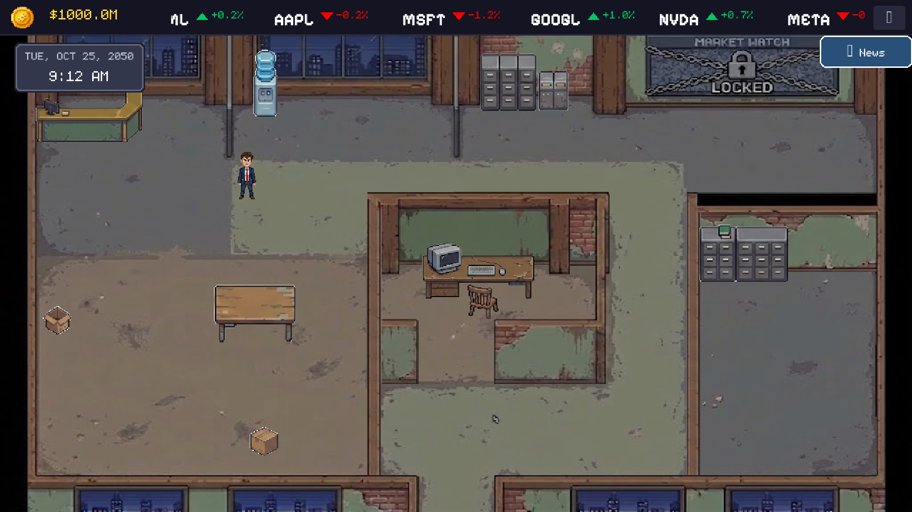
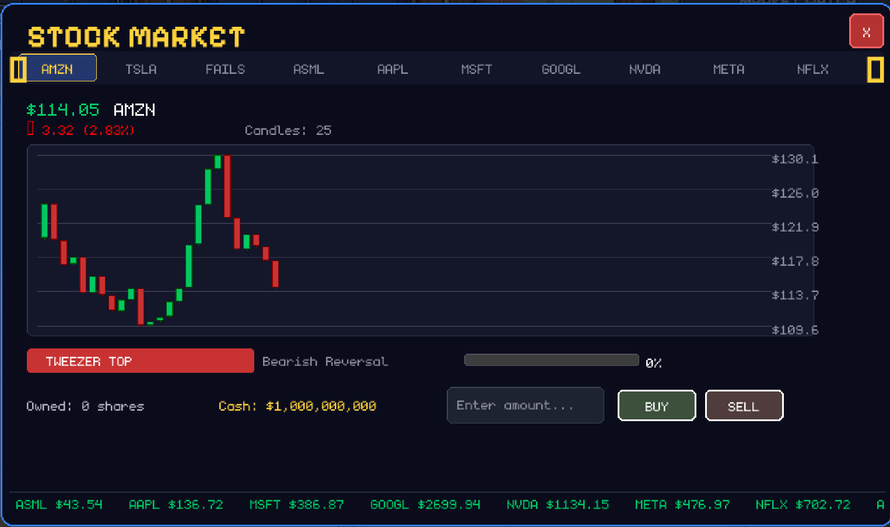
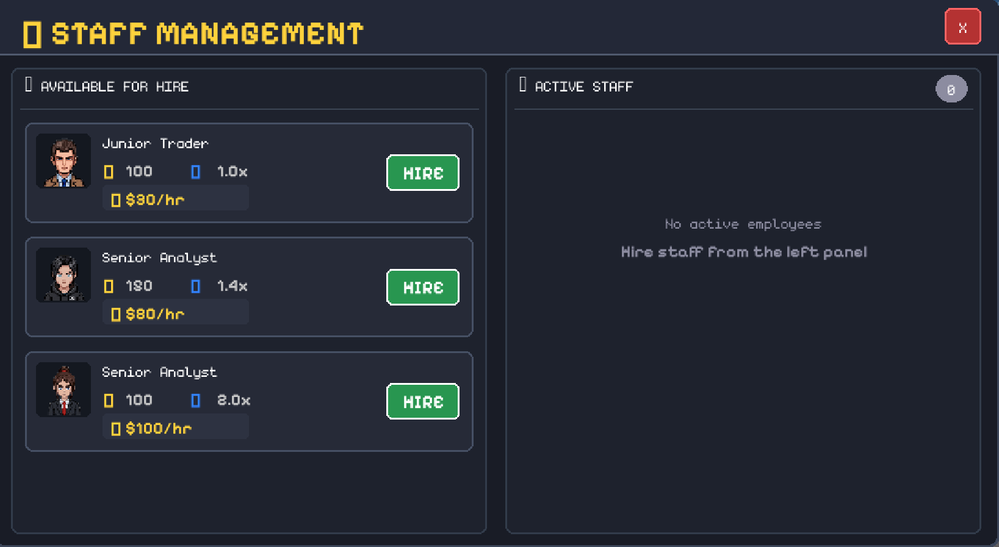
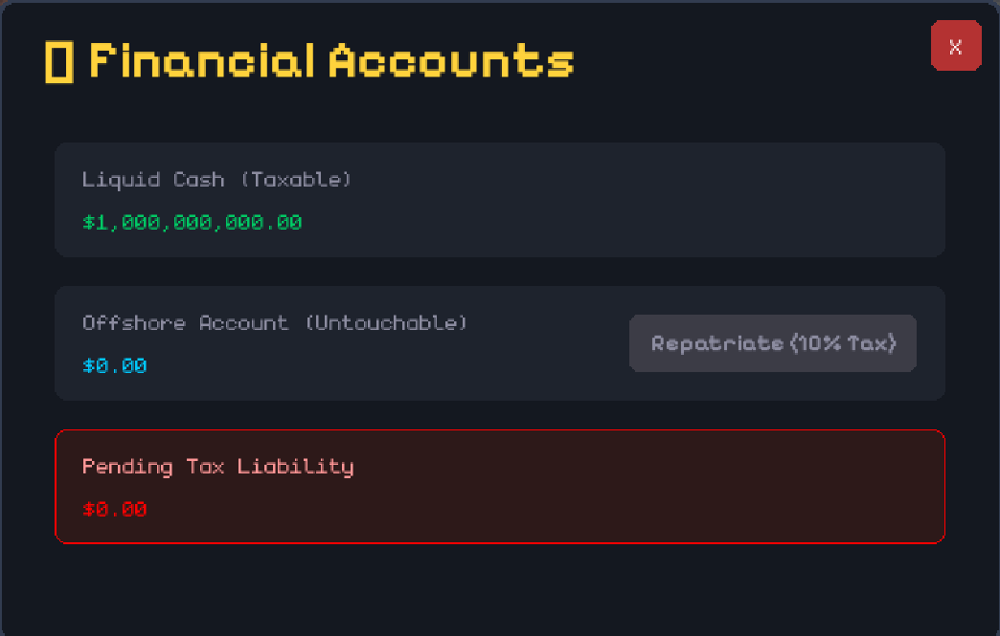
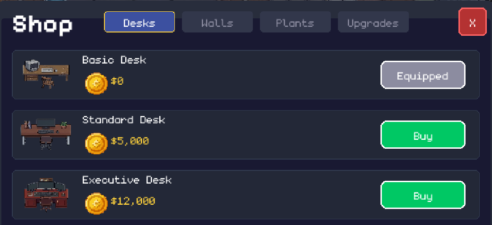

# anpingle-sssuresh-chhatbar-project

# 📊 Pixel Broker

A real-time, fast-paced single-player corporate simulation game built in Python using **Pygame**. Step into the shoes of an ambitious fund manager juggling live market trading context, candlestick technical analysis patterns, office customization, employee recruitment, and tax-evading offshore wire maneuvers—all while avoiding catastrophic audits from the IRS.



---

## 🚀 Key Features

* **Dynamic Candlestick Stock Market:** Trade a variety of volatile stocks. Features high-performance candlestick charts rendering open, high, low, and close (OHLC) values alongside moving gridlines and animated real-time stock ticker banners.
* **Automated Pattern Recognition:** Tracks live asset trend lines to automatically inject and trace technical analysis chart formations (e.g., *Head and Shoulders*, *Double Bottoms*, etc.) complete with progression indicators.

* **Staff Recruitment & Management Panels:** Hire employees from an asset roster pool. Assign distinct occupational roles (e.g., *Salesmen* to aggressively secure liquid cash flows, *Accountants* to smoothly optimize baseline legal tax liabilities). Employees have dynamic stamina decay systems and sleep states.

* **Offshore Accounts & Auditing Risk (IRS):** Evade financial liabilities by physically holding space near your terminal desk to transfer your liquid cash into protected offshore assets. Face active structural IRS Agent sweeps that issue devastating **250% SEC fines** if you are caught wiring funds mid-audit.

* **Office Furnishing Shop:** Spend your hard-earned trading profits to upgrade your office space across multiple categorized layout tiers (`Desks`, `Walls`, `Plants`, `Upgrades`), with support for customizable grid placeables.


---

## 🎮 Extended Controls Manual

| Input | Target Panel / Context Action |
| :--- | :--- |
| **`W`, `A`, `S`, `D` / Arrows** | Character Movement / Adjust Grid Placement Previews |
| **`E`** | Interact with Computer Desk (Opens Main Stock Market Window) |
| **`TAB`** | Toggle Office Furnishing Upgrade Shop |
| **`T`** | Open Staff Management & Recruitment Panel |
| **`P`** | Toggle Personal Portfolio Tracker, Holdings, & Historical P&L |
| **`N`** | Open Live Breaking News Feed |
| **`B`** | Accounts and Tax Liability |
| **`SPACEBAR` (Hold)** | Execute Emergency Asset Transfer to Offshore Accounts |
| **`ENTER`** | Menu Confirmation / Lock Custom Placed Shop Item |
| **`ESC`** | Toggle Global Settings Window / Force-Close Active Interface Layer |
| **`Q`** | Force Exit / Close Current Trading Desk Overlay Menu |
| **`Mouse Click`** | Button Interactivity, Slider Controls, and Context Tabs |

---

## 📁 Project Architecture

The project is structured into distinct modules separating the core gameplay features, game state logic, and user interface. 

```text
.
├── features/                # Core game mechanics and engine features
│   ├── animations.py        # Handles sprite and UI animations
│   ├── assets.py            # Asset loading and management
│   ├── clock.py             # In-game time and scheduling
│   ├── collision.py         # Hitbox and collision detection logic
│   ├── hud.py               # Heads-up display rendering logic
│   ├── interaction.py       # Player interaction with world objects
│   ├── irs.py               # In-game revenue/tax system logic
│   ├── npc.py               # Non-player character behaviors
│   ├── placement.py         # Object/building placement mechanics
│   ├── player.py            # Core player mechanics and movement
│   └── save_manager.py      # Serialization for saving/loading progress
│
├── game/                    # Game state, economy, and progression systems
│   ├── stocks/              # Stock market system mechanics
│   ├── game.py              # Main game loop and state management
│   ├── news.py              # In-game news event generator
│   └── player.py            # Player data and progression state
│
├── saves/                   # Directory containing generated save files
│
├── ui/                      # User interface, rendering, and screens
│   ├── assets/              # UI-specific graphical assets
│   ├── backgrounds/         # Background imagery (contains /walls)
│   ├── characters/          # Character portraits and sprites
│   ├── fonts/               # Custom typography
│   ├── constants.py         # Shared UI configurations (colors, sizes)
│   ├── pygame.py            # Pygame wrapper and initialization
│   └── screens.py           # Menus and interface screen definitions
│
├── .gitignore               # Ignored files for Git version control
├── main.py                  # Main entry point to launch the application
└── README.md                # Project documentation